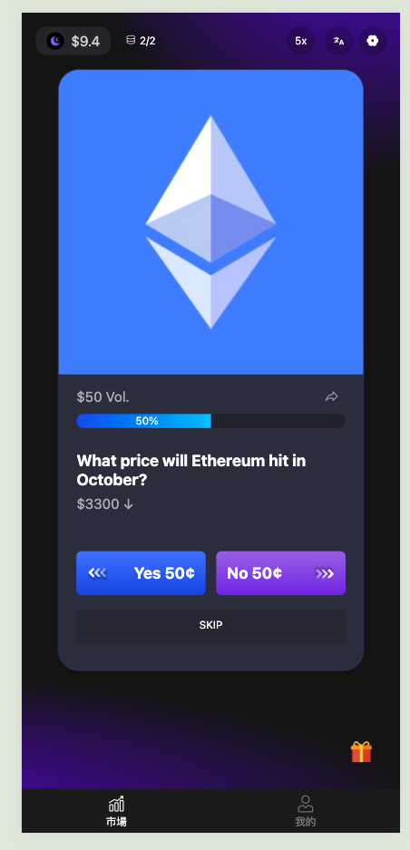
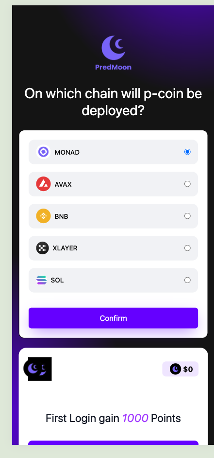
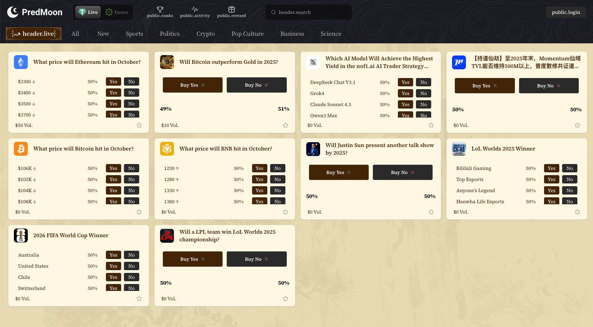
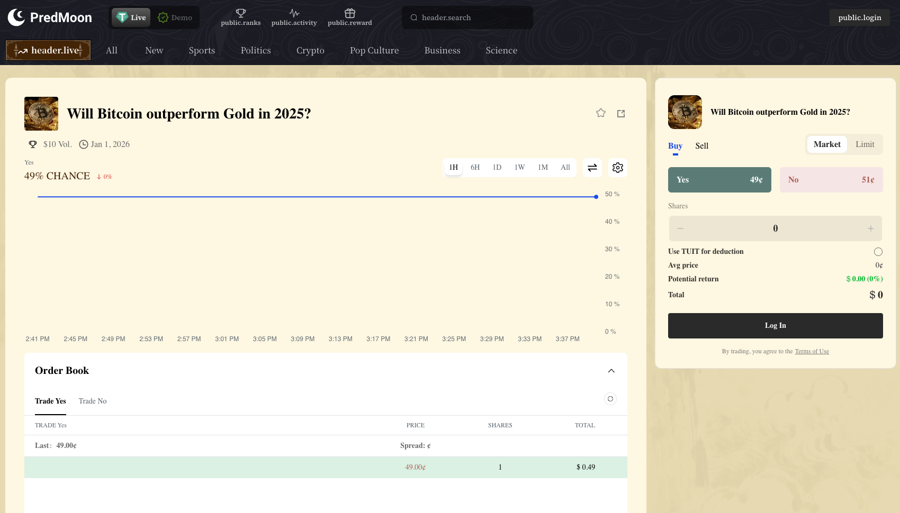

# PredMoon: Tinder-like prediction market for everyone.

## 1. Deliverables

- [x] GitHub Repository
- [x] [Deck](./assets/PredMoon.pdf)
- [x] Pitch Video:
- [x] Product Video:
- [x] Online Demo Link
  - Pro version(the same UI as PolyMarket): https://pro.Pred.WTF
  - Mobile first version: https://Pred.WTF
  - Offchain version: https://Pred.WTF/t-1 (replace t-1 to t-2,3...17)
- [x] Contract Deployment Information
  - Contract Address: 0x323843963e5ea78152742e5595edc6929b150230
  - Blockchain: Binance Smart Chain
  - Explorer: https://bscscan.com/address/0x323843963e5ea78152742e5595edc6929b150230

## Team

Our team brings extensive expertise in both Web2 and Web3 technologies, with 20+ global hackathon awards and successful product scaling experience. We combine deep technical knowledge in blockchain development, frontend engineering, and AI tools with strong entrepreneurial backgrounds from major tech companies including 360, RC, iHealth.

<details>
<summary>Click to expand the details</summary>

### **Founding Team**

**Adam Ma – Founder & CEO**
- **Background**: 15+ years in tech entrepreneurship with extensive Web2 and Web3 experience
- **Web2 Experience**: 360, iHealth , Sneaker Exchange platform (sneaker marketplace with millions in transaction volume)
- **Web3 Expertise**: Won 20+ global hackathon awards
- **Current Focus**: All-in on prediction markets since 2025, leading technical vision and product strategy

**Alfred Fu – Co-founder & CMO**
- **Education**: HKUST graduate with strong technical and creative background
- **Experience**: Years at Tsinghua Research Institute, deep expertise in AI tools and product ideation
- **Role**: Leads product design, social media strategy, and brand development
- **Skills**: Combines technical development experience with creative marketing insights

### **Core Development Team**
- **3 Full-Stack Core Developers**: Experienced team covering backend, frontend, and smart contract development
- **Total Team Size**: 5 members (2 founders + 3 developers) with plans to expand

### **Team Strengths**
- **Balanced Expertise**: Technical depth combined with creative vision and business acumen
- **Web3 Experience**: Extensive blockchain and prediction market knowledge
- **APAC Focus**: Native understanding of Asian markets and cultural nuances
- **Execution Track Record**: Successfully launched functional MVP with real users

</details>

## Architecture & Implementation

- **Overview Diagram**: 


- **Key Modules**:
  - Frontend: Swipe trading system/Embedded wallet/Cross-chain transfer integration
  - Backend: Off-chain order matching/Hybrid decentralized exchange model
  - Contracts: Cross-chain bridge technology/Efficient transaction settlement/Decentralized security/Ecosystem compatibility
  - Others: Self-developed Large Language Model (LLM)
- **Dependencies & Tech Stack**:
  - Frontend: Vue/Nuxt.js, ethers.js, Tailwind CSS, Privy.js
  - Backend: Node.js, Supabase, PostgreSQL
  - Contracts: Rust
  - Deployment: Vercel, AWS

## Roadmap & Impact

- **1-3 Weeks Post-Competition**: Complete continuous optimization of pages and system performance, improve user experience and market stability.
- **1-3 Months Post-Competition**: Drive user growth through cold-start operations and community incentive programs;
  Conduct multiple marketing campaigns to enhance brand exposure and prediction market liquidity;
  Gradually launch PredSeed financing plan to provide funding support for subsequent product expansion and ecosystem construction.
- **Expected Value to Ethereum Ecosystem**: Become the first Chinese-language prediction market project in the Ethereum ecosystem, innovating user experience with unique style, and promoting diversified development of global prediction markets.

## Prediction Market Matching Scenarios

### Asset Definitions

* **`A`** - ERC1155 outcome token
* **`A'`** - ERC1155 complementary outcome token*
* **`C`** - ERC20 collateral token
* All examples assume `A` and `A'` are priced at 0.5 USDC each

*Note: Complementary relationship means 1 outcome token + 1 complementary token can be merged into 1 collateral token, and vice versa (i.e., **`A`** + **`A'`** = **`C`**). Assume outcome tokens and collateral tokens have the same decimal precision. Examples assume **`C`** is USDC.

### Scenario 1 - Minting Transaction

* user1 buys 100 `A`, transfers 50 `C` to exchange
* user2 buys 100 `A'`, transfers 50 `C` to exchange
* Exchange mints 100 `A` for user1, 100 `A'` for user2

```js
const takerOrder = {
    salt: randomId(),
    maker: user1,
    tokenId: 1, // Token ID for A'
    tokenAmount: 100 * 10**6,
    tokenPriceInPaymentToken: 0.5 * 10**6, // 0.5 USDC (could be 0 for market orders)
    paymentTokenAddress: '0xxxxx', // USDC address
    slippageBps: 100, // Allowed slippage (0 indicates limit order)
    deadline: 1672531200, // Expiration timestamp
    side: 1, // 1: buy, 2: sell
    feeTokenAddress: '', // Fee token address (USDC or company token)
    
    // Signature fields
    sig: 'xxxxx', // Frontend signature of above data
    
    // Off-chain calculated transaction details
    exchangeNftAmount: 100 * 10**6, // NFT amount maker will receive
    paymentTokenAmount: 100 * 10**6, // USDC amount maker must pay
    paymentTokenAddress: '0xxxxx', // Payment token address (USDC)
    
    // Dual fee fields for multi-token fee support
    fee1Amount: 123, // Primary fee amount
    fee1TokenAddress: '0xxxxx', // Primary fee token (USDC/company token)
    fee2Amount: 456, // Secondary fee amount
    fee2TokenAddress: '0xxxxx' // Secondary fee token (USDC/company token)
}

const makerOrders = [{
    salt: randomId(),
    maker: user2,
    tokenId: 2, // Token ID for A'
    tokenAmount: 100 * 10**6,
    tokenPriceInPaymentToken: 0.5 * 10**6,
    paymentTokenAddress: '0xxxxx',
    slippageBps: 100,
    deadline: 1672531200,
    side: 1,
    feeTokenAddress: '',
    sig: 'xxxxx',
    exchangeNftAmount: 100 * 10**6,
    paymentTokenAmount: 100 * 10**6,
    paymentTokenAddress: '0xxxxx',
    fee1Amount: 123,
    fee1TokenAddress: '0xxxxx',
    fee2Amount: 456,
    fee2TokenAddress: '0xxxxx'
}]

matchOrders(takerOrder, makerOrders)
```

### Scenario 2 - Regular Transaction

* user1 buys 100 `A`, transfers 50 `C` to exchange
* user2 sells 100 `A`, receives 50 `C` from exchange

### Scenario 3 - Merge Transaction

* user1 sells 100 `A`
* user2 sells 100 `A'`
* Exchange merges 100 `A` + 100 `A'` into 100 `C`
* Exchange transfers 50 `C` to user1
* Exchange transfers 50 `C` to user2

### Fee Mechanism

Fees are collected from output assets (proceeds). For complementary binary tokens (**`A`** + **`A'`** = **`C`**), fees must maintain symmetry to preserve market integrity. Symmetry means selling 100 `A` at $0.99 and buying 100 `A'` at $0.01 should incur equal fee value.

**Rules:**
- Buy operations (receiving **`A`**/**`A'`**) charge fees on output tokens
- Sell operations (receiving **`C`**) charge fees on collateral tokens

Base fee rate (`baseFeeRate`) is written into order structure, corresponding to 2x fee rate when tokens are equally priced ($0.50/$0.50). Price deviations use formula:

`USDC fee = baseFeeRate * min(price, 1-price) * token quantity`

*Example 1:*
- price = 0.2
- feeBps = 100
- fee = 0.01 * min(0.2, 0.8) * 100 = 0.2

*Example 2:*
- Selling 100 `A` at $0.99:  
  0.01 * min(0.99, 0.01) * 100 = 0.01 (deduct 0.01 `C` as fee)
- Buying 100 `A'` at $0.01:  
  0.01 * min(0.01, 0.99) * 100 = 0.01 (deduct 1 `A'` as fee)

## 6. Screenshots && Demo

[](https://youtu.be/L1EUuGuA4kk)

*Click the image above to watch the Welcome Screen video*

[](https://youtube.com/shorts/aVr3gImS8a8)

*Click the image above to watch the Swipe to trade Screen video*

  
  
  
  
  